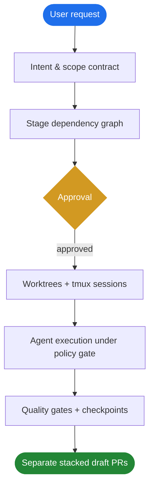
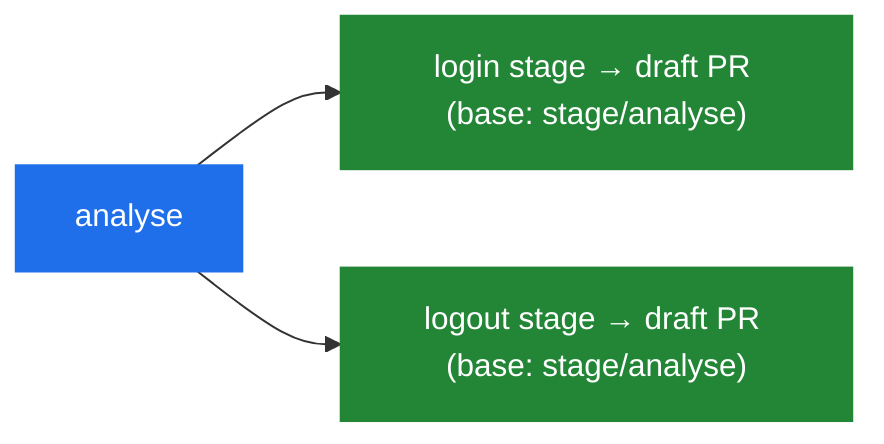

<div align="center">

# 🚆 AgentRail

### Put AI coding agents on rails.

**A local, CLI-first workflow control plane that wraps coding agents**
**(jcode, Claude Code, Codex, Gemini CLI) with governance, staging, and observability.**

[](https://github.com/imthi16/agentrail/actions/workflows/ci.yml)
[](https://www.python.org/downloads/)
[](#-license)
[](https://mypy-lang.org/)
[](https://github.com/astral-sh/ruff)

[Why](#-why-agentrail) · [How it works](#-how-it-works) · [Quick start](#-quick-start) · [Commands](#-commands) · [Capability modes](#-capability-modes) · [Roadmap](#-roadmap)

</div>

---

AgentRail is a **workflow supervisor, not an execution engine**. It never reimplements a
harness's editing or LLM calls. Instead it decomposes a request into a dependency graph of
**stages**, runs each in an isolated **git worktree** under an enforced **capability mode**,
checkpoints before risky work, and opens a **stacked draft PR** per stage. Every decision is
written to an append-only, replayable timeline.

```console
$ agentrail plan "Implement login and logout as separate PRs"
Planned 3 stage(s) → .agentrail/workflow.yaml   status: awaiting_approval
┏━━━━━━━━━┳━━━━━━━━━━━━━━━━━━━━━━━━━━━━━━━━━━━━━┳━━━━━━━━━━━━┳━━━━━━━━━┓
┃ id      ┃ title                               ┃ depends_on ┃ status  ┃
┡━━━━━━━━━╇━━━━━━━━━━━━━━━━━━━━━━━━━━━━━━━━━━━━━╇━━━━━━━━━━━━╇━━━━━━━━━┩
│ analyse │ Analyse repository and requirements │ -          │ pending │
│ login   │ Implement and validate login        │ analyse    │ pending │
│ logout  │ Implement and validate logout       │ analyse    │ pending │
└─────────┴─────────────────────────────────────┴────────────┴─────────┘
```

---

## ✨ Why AgentRail?

Coding agents are powerful, but most tools start editing immediately and treat a large
request as one long, unbounded session. AgentRail puts the work on rails:

| Without rails | With AgentRail |
| :--- | :--- |
| Edits begin before you agree on scope | **Plan first**, approve, then execute |
| One giant session, hard to review | **Independent stages**, one PR each |
| The agent can touch anything | **Intent Lock** bounds files + commands |
| A bad run corrupts your checkout | **Isolated worktrees** + checkpoints |
| "What did it actually do?" | **Append-only JSONL timeline** you can replay |
| Long processes die with the tool | **tmux supervision** that survives crashes |

---

## 🧭 How it works



The canonical example — *"implement login and logout as separate PRs"* — fans out into two
independent stages that each become their own worktree, branch, and **stacked** draft PR:



---

## 🚀 Quick start

> Requires **Python 3.11+**.

```bash
python -m venv .venv && source .venv/bin/activate
pip install -e ".[dev]"

agentrail init                                              # create .agentrail/
agentrail plan "Implement login and logout as separate PRs" # build the stage DAG
agentrail approve                                           # unlock execution
agentrail run --dry-run                                     # preview worktrees + PRs
```

This writes `.agentrail/config.yaml` and `.agentrail/workflow.yaml`. All runtime state lives
under `.agentrail/` and is gitignored.

---

## 🎛️ Commands

| Command | What it does |
| :--- | :--- |
| `agentrail init` | Scaffold `.agentrail/` with project config |
| `agentrail plan "<goal>"` | Decompose a goal into a validated stage DAG |
| `agentrail status` | Show workflow status, stages, and PR state |
| `agentrail approve` | Approve a plan so it can run |
| `agentrail run [--dry-run]` | Execute stages: worktree → checkpoint → agent → stacked PR |
| `agentrail pause` / `resume` | Pause a run; resume from where it stopped |
| `agentrail rollback <stage>` | Reset a stage's worktree to a checkpoint (that worktree only) |
| `agentrail ready [stage]` | Promote draft PR(s) to ready once the merge gate passes |

---

## 🔒 Capability modes

Modes are a **deterministic state machine enforced in Python** at the subprocess-interception
layer — never in a prompt. Deny rules always win, and enforcement fails closed.

| Mode | File reads | File edits | Shell commands |
| :--- | :---: | :---: | :---: |
| `plan` | ✅ allow | ⛔ deny | ⛔ deny |
| `manual` | ✅ allow | 🟡 ask | 🟡 ask |
| `accept_edits` | ✅ allow | ✅ auto | 🟡 ask |
| `auto` | ✅ allow | ✅ within Intent Lock | ✅ within Intent Lock |

An **Intent Lock** (`allowed_paths`, `denied_paths`, `shell_allow`, `shell_deny`) is hashed
with SHA-256 and pinned to the stage; a tampered lock is detected and rejected.

---

## 🧠 Model profiles

The picker is two steps — pick a **provider**, then an **effort tier**. Volatile model IDs
live in one config table, never hardcoded in code paths. Planning routes to *Deep*,
implementation to *Balanced*, lint/format to *Fast*, with auto-downgrade logged to the timeline.

| Tier | Anthropic | Google | OpenAI |
| :--- | :--- | :--- | :--- |
| **Deep** | `claude-opus-4-8` | `gemini-3.1-pro-preview` | `gpt-5.6-sol` |
| **Balanced** | `claude-sonnet-4-6` | `gemini-3.5-flash` | `gpt-5.6-terra` |
| **Fast** | `claude-haiku-4-5-20251001` | `gemini-3.1-flash-lite` | `gpt-5.6-luna` |

---

## 📄 Example workflow

```yaml
goal: Implement login and logout as separate PRs
mode: plan
status: awaiting_approval
stages:
  - id: analyse
    title: Analyse repository and authentication requirements
    depends_on: []
  - id: login
    title: Implement and validate login
    depends_on: [analyse]
  - id: logout
    title: Implement and validate logout
    depends_on: [analyse]
```

---

## 🏗️ Architecture

```text
agentrail/
├── cli.py           # Typer commands (the control surface)
├── config.py        # project config + budgets
├── models.py        # pydantic models — the serialization source of truth
├── workflow.py      # DAG planner + persistence
├── runner.py        # stage-by-stage execution loop
├── policies/        # capability modes + Intent Lock + interception gate
├── workspaces/      # git worktree isolation
├── checkpoints/     # snapshots, rollback, semantic edit guard
├── tmux/            # libtmux session + pane supervision
├── git/             # branches, commits, stacked draft PRs
├── profiles/        # provider/tier picker, model router, budgets
├── adapters/        # jcode (default) + Claude Code / Codex / Gemini
└── events/          # append-only JSONL timeline + replay
```

**State is file-based (no database):** `config.yaml`, `workflow.yaml`,
`events/events.jsonl`, `checkpoints/<stage>/`, and `worktrees/<stage>/`.

---

## 🗺️ Roadmap

<table>
<tr><th align="left">v0.1 — Control plane</th><th align="left">v0.2 — Governance &amp; routing</th></tr>
<tr valign="top"><td>

- [x] Package + CLI scaffold
- [x] Project initialization
- [x] Workflow generation
- [x] Plan / Manual / Edit / Auto modes
- [x] Intent Lock scope contract
- [x] Stage DAG validation
- [x] Git worktree manager
- [x] tmux supervisor
- [x] Checkpoint + rollback
- [x] Stacked draft PRs (with dry-run)

</td><td>

- [x] jcode adapter
- [x] Read-before-edit guard
- [x] Model / provider / tier picker
- [x] Cost + retry budgets
- [x] GitHub CI + merge gates
- [x] Structured JSONL timeline

</td></tr>
</table>

**v0.3 (in progress)** — live Claude Code / Codex / Gemini session I/O · React dashboard ·
remote execution · full workflow replay · runtime debugging.

---

## 🤝 Contributing

AgentRail is at the design and MVP stage. Issues and architecture discussions are welcome —
the full gate is `ruff check agentrail && mypy agentrail && pytest -q`.

## 📜 License

Released under the **MIT License**.

<div align="center"><sub>Built to make autonomous agents auditable, reversible, and safe.</sub></div>
