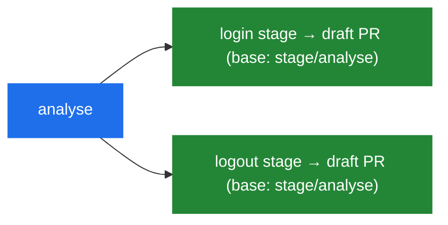

<div align="center">

# 🚆 AgentRail

### Put AI coding agents on rails.

**A local, CLI-first workflow control plane that wraps coding agents**
**(jcode, Claude Code, Codex, Gemini CLI) with governance, staging, and observability.**

[](https://github.com/imthi16/agentrail/actions/workflows/ci.yml)
[](https://www.python.org/downloads/)
[](#-license)
[](https://mypy-lang.org/)
[](https://github.com/astral-sh/ruff)

[Why](#-why-agentrail) · [How it works](#-how-it-works) · [Quick start](#-quick-start) · [Commands](#-commands) · [Capability modes](#-capability-modes) · [Roadmap](#-roadmap)

</div>

---

AgentRail is a **workflow supervisor, not an execution engine**. It never reimplements a
harness's editing or LLM calls. Instead it decomposes a request into a dependency graph of
**stages**, runs each in an isolated **git worktree** under an enforced **capability mode**,
checkpoints before risky work, and opens a **stacked draft PR** per stage. Every decision is
written to an append-only, replayable timeline.

```console
$ agentrail plan "Implement login and logout as separate PRs"
Planned 3 stage(s) → .agentrail/workflow.yaml   status: awaiting_approval
┏━━━━━━━━━┳━━━━━━━━━━━━━━━━━━━━━━━━━━━━━━━━━━━━━┳━━━━━━━━━━━━┳━━━━━━━━━┓
┃ id      ┃ title                               ┃ depends_on ┃ status  ┃
┡━━━━━━━━━╇━━━━━━━━━━━━━━━━━━━━━━━━━━━━━━━━━━━━━╇━━━━━━━━━━━━╇━━━━━━━━━┩
│ analyse │ Analyse repository and requirements │ -          │ pending │
│ login   │ Implement and validate login        │ analyse    │ pending │
│ logout  │ Implement and validate logout       │ analyse    │ pending │
└─────────┴─────────────────────────────────────┴────────────┴─────────┘
```

---

## ✨ Why AgentRail?

Coding agents are powerful, but most tools start editing immediately and treat a large
request as one long, unbounded session. AgentRail puts the work on rails:

| Without rails | With AgentRail |
| :--- | :--- |
| Edits begin before you agree on scope | **Plan first**, approve, then execute |
| One giant session, hard to review | **Independent stages**, one PR each |
| The agent can touch anything | **Intent Lock** bounds files + commands |
| A bad run corrupts your checkout | **Isolated worktrees** + checkpoints |
| "What did it actually do?" | **Append-only JSONL timeline** you can replay |
| One model does everything | **Per-role routing**: plan → Opus, code → GLM-5.3, review → GPT-5.6 Sol |
| Long processes die with the tool | **tmux supervision** that survives crashes |

---

## 🧭 How it works


The canonical example — *"implement login and logout as separate PRs"* — fans out into two
independent stages that each become their own worktree, branch, and **stacked** draft PR:



---

## 🚀 Quick start

> Requires **Python 3.11+**.

```bash
python -m venv .venv && source .venv/bin/activate
pip install -e ".[dev]"

export OPENCODE_API_KEY=...                                 # only for OpenCode-bound roles

agentrail init                                              # create .agentrail/
agentrail plan "Implement login and logout as separate PRs" # build the stage DAG
agentrail approve                                           # unlock execution
agentrail run --dry-run                                     # preview worktrees + PRs
```

This writes `.agentrail/config.yaml` and `.agentrail/workflow.yaml`. All runtime state lives
under `.agentrail/` and is gitignored. `config.yaml` carries the `roles:` routing table and
the `opencode:` endpoint (`go` by default — flip `base_url` to Zen if that's your plan).

---

## 🎛️ Commands

| Command | What it does |
| :--- | :--- |
| `agentrail init` | Scaffold `.agentrail/` with project config |
| `agentrail plan "<goal>"` | Decompose a goal into a validated stage DAG |
| `agentrail status` | Show workflow status, stages, and PR state |
| `agentrail approve` | Approve a plan so it can run |
| `agentrail run [--dry-run]` | Execute stages: worktree → checkpoint → agent → stacked PR |
| `agentrail pause` / `resume` | Pause a run; resume from where it stopped |
| `agentrail rollback <stage>` | Reset a stage's worktree to a checkpoint (that worktree only) |
| `agentrail ready [stage]` | Promote draft PR(s) to ready once the merge gate passes |

---

## 🔒 Capability modes (design contract)

Modes are a **deterministic state machine enforced in Python** — never in a prompt. Deny
rules always win, and enforcement fails closed.

| Mode | File reads | File edits | Shell commands |
| :--- | :---: | :---: | :---: |
| `plan` | ✅ allow | ⛔ deny | ⛔ deny |
| `manual` | ✅ allow | 🟡 ask | 🟡 ask |
| `accept_edits` | ✅ allow | ✅ auto | 🟡 ask |
| `auto` | ✅ allow | ✅ within Intent Lock | ✅ within Intent Lock |

An **Intent Lock** (`allowed_paths`, `denied_paths`, `shell_allow`, `shell_deny`) is hashed
with SHA-256 and pinned to the stage; a tampered lock is detected and rejected.

> **Enforcement scope today.** AgentRail enforces modes at **session admission**: before a
> stage's harness launches in its worktree, the policy gate evaluates mode + Intent Lock and
> denies (`plan`), asks (`manual`), or allows (`accept_edits`/`auto` — the latter only with a
> verified lock). The per-action layer that gates each individual edit and shell command a
> harness performs is implemented and unit-tested (`PolicyGate.run_shell` /
> `PolicyGate.write_file`) but is **not yet wired into harness execution**. While the harness
> subprocess runs, containment comes from the **worktree boundary, the pre-stage checkpoint,
> and the post-harness edit guard** — not from per-action policy. See
> [ADR 0001](docs/adr/0001-admission-gate-vs-per-action-interception.md).

---

## 🧠 Role-based model routing

The picker is two steps — pick a **provider**, then an **effort tier**. On top of that sits a
**roles table**: each stage's role (`plan`, `research`, `code`, `review`) binds to a
`(provider, tier)` in `.agentrail/config.yaml`, so different LLMs handle different parts of
the solo-developer pipeline. Volatile model IDs live in that one config table, never
hardcoded in code paths; every tier change is logged to the timeline.

| Role | Anthropic | Google | OpenAI | z.ai | OpenCode |
| :--- | :--- | :--- | :--- | :--- | :--- |
| **plan** | `claude-opus-4-8` | `gemini-3.1-pro-preview` | `gpt-5.6-sol` | `glm-5.3` | `kimi-k3` |
| **research** | — | — | — | `glm-5.2` | `kimi-k3` (1M ctx) |
| **code** (default) | — | — | — | `glm-5.3` | — |
| **review** (default) | — | — | `gpt-5.6-sol` | — | — |
| **lint/format fallback** | `claude-haiku-4-5-20251001` | `gemini-3.1-flash-lite` | `gpt-5.6-luna` | `glm-5.3-flash` | `qwen3.8-flash` |

Defaults map each **plan** stage to `anthropic/deep`, **code** to `zai/deep`, and **review**
to `openai/deep`; override any role with `roles:` in `.agentrail/config.yaml`. OpenCode
runs over the **Go** or **Zen** endpoints — set `opencode.base_url` accordingly and put your
key in `OPENCODE_API_KEY` (never in YAML). Model IDs verified against z.ai docs and the
OpenCode Zen catalog (Aug–Sep 2026); re-verify before re-pinning, per `profiles/CLAUDE.md`.

---

## 📄 Example workflow

```yaml
goal: Implement login and logout as separate PRs
mode: plan
status: awaiting_approval
stages:
  - id: analyse
    title: Analyse repository and authentication requirements
    depends_on: []
  - id: login
    title: Implement and validate login
    depends_on: [analyse]
  - id: logout
    title: Implement and validate logout
    depends_on: [analyse]
```

---

## 🏗️ Architecture

```text
agentrail/
├── cli.py           # Typer commands (the control surface)
├── config.py        # project config + budgets
├── models.py        # pydantic models — the serialization source of truth
├── workflow.py      # DAG planner + persistence
├── runner.py        # stage-by-stage execution loop
├── policies/        # capability modes + Intent Lock + interception gate
├── workspaces/      # git worktree isolation
├── checkpoints/     # snapshots, rollback, semantic edit guard + checks
├── tmux/            # libtmux session + pane supervision + harness executor
├── git/             # branches, commits, stacked draft PRs
├── profiles/        # provider/tier picker, model router, budgets
├── adapters/        # jcode (default) + OpenCode API (Go/Zen) + Claude Code / Codex / Gemini
└── events/          # append-only JSONL timeline + replay
```

**State is file-based (no database):** `config.yaml`, `workflow.yaml`,
`events/events.jsonl`, `checkpoints/<stage>/`, and `worktrees/<stage>/`.

---

## 🔭 Known limitations

Stated plainly, because a control plane that overstates its own guarantees is worse than one
that documents them:

- **Per-action policy enforcement is not live during harness execution.** Modes gate the
  *session*, not each edit or command — see [Capability modes](#-capability-modes-design-contract).
- **Harness session I/O is not streamed.** Adapters launch a harness and wait; AgentRail does
  not yet observe individual tool calls, which is the prerequisite for per-action gating.
- **A routed model does not always reach the harness.** Only adapters declaring
  `model_selection` (OpenCode today) apply it; otherwise the choice is logged as
  `profile.model_not_applied` rather than silently dropped. jcode takes a model flag only if
  you set `harness_options.model_flag` — AgentRail ships no unverified CLI flags.
- **The Semantic Edit Guard is a quality gate, not a security boundary.** Its checks are an
  allowlisted command set run outside `PolicyGate`; failures revert the stage worktree to its
  checkpoint.
- **Draft PRs degrade to dry-run** without an authenticated `gh` and a pushable remote.

---

## 🗺️ Roadmap

<table>
<tr><th align="left">v0.1 — Control plane</th><th align="left">v0.2 — Governance &amp; routing</th></tr>
<tr valign="top"><td>

- [x] Package + CLI scaffold
- [x] Project initialization
- [x] Workflow generation
- [x] Plan / Manual / Edit / Auto modes
- [x] Intent Lock scope contract
- [x] Stage DAG validation
- [x] Git worktree manager
- [x] tmux supervisor
- [x] Checkpoint + rollback
- [x] Stacked draft PRs (with dry-run)

</td><td>

- [x] jcode adapter
- [x] Read-before-edit guard
- [x] Model / provider / tier picker
- [x] Cost + retry budgets
- [x] GitHub CI + merge gates
- [x] Structured JSONL timeline

</td></tr>
</table>

**v0.3 (in progress)** — role-based multi-LLM routing (plan / research / code / review) ·
z.ai + OpenCode Go/Zen provider · live Claude Code / Codex / Gemini session I/O ·
React dashboard · remote execution · full workflow replay · runtime debugging.

---

## 🤝 Contributing

AgentRail is at the design and MVP stage. Issues and architecture discussions are welcome —
the full gate is
`ruff check agentrail tests && ruff format --check agentrail tests && mypy agentrail && pytest -q`.

## 📜 License

Released under the **MIT License**.

<div align="center"><sub>Built to make autonomous agents auditable, reversible, and safe.</sub></div>
